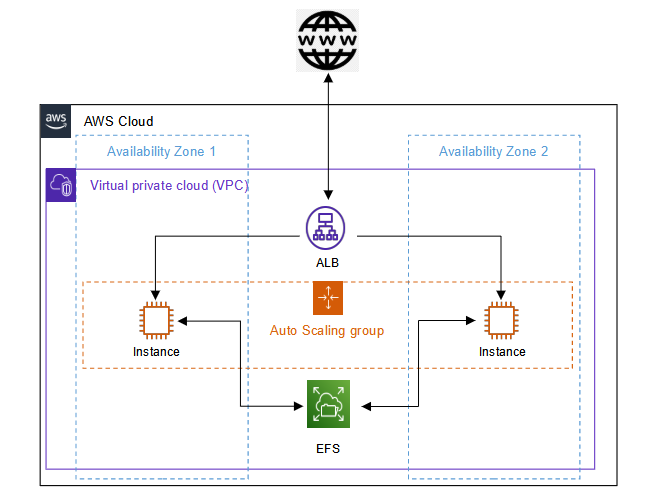

# HA_Jenkins_ASG_EFS_ELB
<ul>
<li> This is a project where I have configured the required AWS services like EC2, ELB, ASG, SG and etc to setup the high availability jenkins for small teams with minimum of 2 EC instances which in-sync together. </li> 

<li> In this project, We are using EFS as storage file system for jenkins. We have attached this EFS to /var/lib/jenkins path in the Launch configuration of EC2 in user data.</li> 

<li> Configured a cronjob which keeps the jenkins in-sync with EFS changes made by the other jenkins server.</li>

<li> Utilised ALB to expose the jenkins servers.</li>

<li> Auto-scaling groups are used to maintained the minimum of 2 EC2 instances always.</li>

<li> Go through this <a href="HA_JENKINS.pdf">PDF</a> to setup the following HA_Jenkins architecure.</li>
</ul>
 
# ARCHITECTURE:

